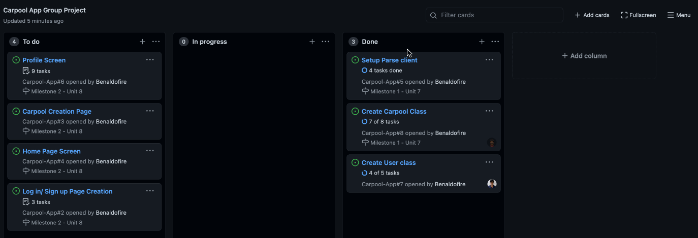

# CarpoolApp

# Week 8

## User Stories

The following functionality is completed:

## Carpool Creation Page

Allows users to create new rides 
- [x] User can compose a new ride
- [x] Can set source Location 
- [x] Set destination location
- [x]  Set price
- [x] Set capacity
- [x] Set description

## Log in/ Sign up Page Creation part 2

Creating a login page to allow users to sign up to create a new account 
- [x] User can sign up to create a new account using Parse authentication
- [x] Users can log in and log out of their account
- [x] The current signed-in user is persisted across app restarts

## Video Walkthrough

Here's a walkthrough of implemented user stories:

# Week 7

## User Stories

The following functionality is completed:

## Setup Parse client
- [x] Create a dashbord for parse server.
- [x] Add parse Client to project
- [x] Create templates for necessary stater classes
- [x] Push project to github

## Create Carpool Class

1. Create Setters and Getter methods for the following.
- [x] Takeoff location 
- [x] Destination location
- [x] Description of Ride
- [x] Price 

2. Only Getter for the following 
- [x] CreatedAt
- [x] UpdatedAt
- [x] Host/User (get current logged in user)

## Create User Class
Create the user class using the parse client's variables 

1. Required
- [x] Create setter and getters for associated variable names 
- [x] Setter & getter for  name (first and last) 
- [x] Setter & getter for location (String)

2. Optional 
- [x] Setter and getter for Notification Status 

## Video Walkthrough

Here's a walkthrough of implemented user stories:

## Table of Contents
1. [Overview](#Overview)
1. [Product Specification](#Product-Spec)
1. [Wireframes](#Wireframes)
1. [Schema](#Schema)

## Overview
### Description
A carpool app which helps connect a lift seeker and lift giver to different geographical locations. Potentially could be used as a ride sharing app on campus and building connections.

### App Evaluation
- **Category:** Social Networking / Rides
- **Mobile:** This app would be primarily developed for mobile such as Uber. Currently functionality would be primarily focused on mobile.
- **Story:** Utilizes user location, and profileto connect them to other users and rides with within the same location. The user can then decide to join the ride or message the host of the ride for more information.
- **Market:** Any user could use this, but this will be very popular amongst college students and for safety reasons there will be an age limit to ensure that kids aren’t traveling without a guardian. 

## Product Spec
### 1. User Stories (required and optional)

**Required Stories**

* User can sign up to create a new account 
* Allows user to log in and out of their account .
* The current signed in user is persisted across app restarts
* Allows user to create new rides and join existing.
* Profile page for each user to edit their account
* Settings to edit accessibility/notifications

**Optional Nice-to-have Stories**

* Allows other users to rate a user (Allows people to avoid unreliable suers)	
* Log of past rides
* Filter and sort rides.
* Ride can be updated after creation (Only 48hrs before departure)
* Notifies current people in specific carpool ride when there is an update to the ride details.
* Allows user to message other users associated with a ride or on their friend list.

### 2. Screen Archetypes

* Login Screen: Allows users with existing account to login to carpool site
* Register Screen: Allows new users to create an account -> sends them to Home page.
* Home Screen: Displays list of carpool rides in current location/area that are available
* Ride Screen (detailed view): Displays details associated with the specific ride. 
    * Number of seats available, location (take off & destination), host, time, price etc.
    * Shows description that the user included
* Create a Ride: Allows users to create a new carpool ride and select options associated with the ride.
    * Takeoff location and destination location
    * Number of seats
    * Description about the ride, things people should take note of.
    * Optional: The creator of the carpool can approve or decline the person’s application to join.
* Profile Screen: Allows user to edit their profile and include their personal details.
    * User can change notification settings, background/night mode.
    * Optional - rides joined: displays rides that they have signed up for
    * Optional - rides created: displays rides they have created
    * Optional: rides log?
* (Optional) Messaging screen: Allow users to contact other users.

### 3. Navigation

**Tab Navigation (Nav Bar) **
* Home
* Profile (will have settings & log out option within)
* Create Ride
    
**Flow Navigation**
* Login page loads if no one is logged in -> Sign up if new user
* Logged in -> Jumps to home page
* Click ride -> goes to detailed page
* Click create -> goes to creation page, then submit -> goes to home page, displaying new ride

## Wireframes
 

## Schema 
### Models
#### Post

   | Property      | Type     | Description |
   | ------------- | -------- | ------------|
   | userId      | Pointer to User   |  user who created the ride |
   | rideId        | String | Unique id for the posted/created ride |
   | Profile image        |File    | Profile image that user uploads |
   | description         | String     | Description included within the ride, made by the user |
   | from       | String   | Boarding location of ride |
   | To       | String   | Destination location of ride |
   | Capacity       | String   | current capacity of ride |
   | createdAt       | String   | When the ride was created |
   | updatedAt | Number   | Date when posted ride was updated |
   
#### Profile

   | Property      | Type     | Description |
   | ------------- | -------- | ------------|
   | user name      | String   |  User's profile name |
   | background         | boolean | status of night/day mode |
   | Location        |String    | Current location of the user |
   
### Networking
#### List of network requests by screen

- Home Feed Screen
    - (Read/GET) Query all posts by location/user preferences/filter
    - (Update/PUT) Quick join - Update selected carpool/ride to add user to it.
- Ride Screen (detailed) 
    - (Update/PUT) Updated carpool count on server once user joins/exits ride.
- Create Ride Screen
    - (Create/POST) Create a new ride post
- Profile/Settings Screen 
    - (Update/PUT) Update user profile/settings details (upon save)
- Profile Screen -> Rides Created (Optional feature)
    - (Delete) Delete existing ride created
    - (Update/PUT) Update ride created

